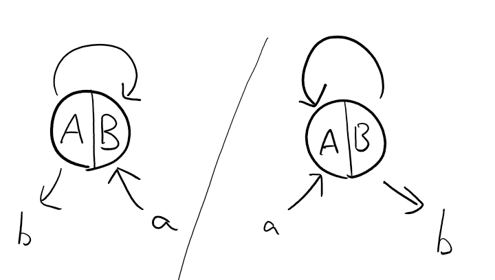
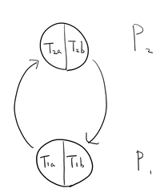
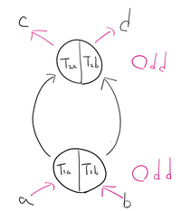
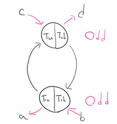
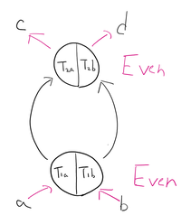
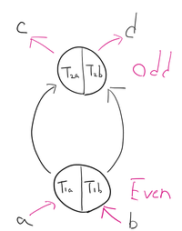

# 結び目グラフの同値判定
## 目次
1. 概要
2. 空頂点の削除
3. RI-
4. 頂点の結合
5. 再構築
6. 比較

## 1. 概要
2つの結び目グラフG1, G2(step>=1)は以下の手順で同値判定ができる。
+ 空頂点の削除
+ RI- 
+ 頂点の結合
+ 再構築
+ 比較

---

## 2. 空頂点の削除

空頂点nと任意の頂点a, bがあり、かつ辺(a, n, Ta, None)と(n, b, None, Tb)の2辺があるとき、この2辺と空頂点nを削除し辺(a, b, Ta, Tb)を追加できる。

---

## 3. RI-

Odd頂点Oと任意の頂点a, bがあり、かつ辺(O, O, A, B)または(O, O, B, A)があるとき、この辺とOdd頂点Oを削除し、この時
+ (a, O, Ta, B), (O, b, A, Tb)
+ (a, O, Ta, A), (O, b, B, Tb)
のどちらかのペアが存在しているためその2辺を削除し、(a, b, Ta, Tb)を追加する

---

## 4. 頂点の結合
### 前提
Odd頂点またはEven頂点である点P1, P2および、P1, P2と辺でつながっている頂点a, b, c, dがある。この時、a, b, c, dとつながっている辺はそれぞれ頂点のTa, Tb, Tc, Td側に繋がっているとする。

### typeの分類

+ (P1, P2, A, A), (P1, P2, B, B)
+ (P1, P2, A, B), (P1, P2, B, A)

のどちらかのペアが存在する場合type-A、

+ (P1, P2, A, A), (P2, P1, B, B)
+ (P1, P2, A, B), (P2, P1, A, B)
+ (P1, P2, B, A), (P2, P1, B, A)

のどれかのペアが存在する場合type-Bとして頂点の統合ができる。

この時、type-Aの2種とtype-Bの3種はそれぞれ頂点のABを入れ替えることで同じになるため、簡単のために以下のように表現する

#### type-A

(P1, P2, T1a, T2a), (P1, P2, T1b, T2b)

#### type-B

(P1, P2, T1a, T2a), (P2, P1, T2b, T1b)

### 偶奇の分類
P1, P2の偶奇の組み合わせによって以下の4種類に分かれる。
+ Odd-Odd
+ Even-Even
+ Odd-Even
+ Even-Odd

#### Odd-Odd
##### type-A

(a, P1, Ta, T1a), (P2, c, T2a, Tc), (b, P1, Tb, T1b), (P2, d, T2b, d)の4辺が存在する。

最初の2辺とこの4辺、およびP1, P2を削除し、

Even頂点Eと辺(a, E, Ta, T1a), (E, c, T1a, Tc), (b, E, Tb, T1b), (E, d, T1b, Td)を追加する。

##### type-B

(c, P2, Tc, T2a), (P1, a, T1a, Ta), (b, P1, Tb, T1b), (P2, d, T2b, Td)の4辺が存在する。

最初の二辺とこの4辺、およびP1, P2を削除し、

Even頂点Eと辺(c, E, Tc, T1a), (E, a, T1a, Ta), (b, E, Tb, T1b), (E, d, T1b, Td)を追加する。

#### Even-Even
##### type-A

Odd-Oddのtype-Aと同じ。

##### type-B

(a, P1, Ta, T1a), (P2, c, T2a, Tc), (d, P2, Td, T2b), (P1, b, T1b, Tb)の4辺が存在する。

最初の2辺とこの4辺、およびP1, P2を削除し、

Even頂点Eと辺(a, E, Ta, T1a), (E, c, T1a, Tc), (d, E, Td, T1b), (E, b, T1b, Tb)を追加する。

#### Odd-Even
##### type-A

(a, P1, Ta, T1a), (P2, d, T2b, d), (b, P1, Tb, T1b), (P2, c, T2a, Tc)の4辺が存在する。

最初の2辺とこの4辺、およびP1, P2を削除し、

Odd頂点Oと辺(a, O, Ta, T1a), (O, d, T1b, Td), (b, O, Tb, T1b), (O, c, T1a, Tc)を追加する。

##### type-B

(d, P2, Td, T2b), (P1, a, T1a, Ta), (b, P1, Tb, T1b), (P2, c, T2a, Tc)の辺が存在する。

最初の2辺とこの4辺、およびP1, P2を削除し、

Odd頂点Oと辺(d, O, Td, T1b), (O, a, T1a, Ta), (b, O, Tb, T1b), (O, c, T1a, Tc)を追加する。

#### Even-Odd
##### type-A

Odd-Evenのtype-Aと同じ。
##### type-B

(a, P1, Ta, T1a), (P2, d, T2b, Td), (c, P2, Tc, T2a), (P1, b, T1b, Tb)の4辺が存在する。

最初の2辺とこの4辺、およびP1, P2を削除し、

Odd頂点Oと辺(a, O, Ta, T1a), (O, d, T1b, Td), (c, O, Tc, T1a), (O, b, T1b, Tb)を追加する。

---

## 5. 再構築
### 目的
S+を複数回行って，異なる遷移を経て生成されたKEGのG1とG2がある．G1とG2がknot projectionとして同一であっても，グラフとしては同一でない，すなわち頂点の番号付けや，頂点のABの決定が異なる場合がある．このような場合，G1とG2がグラフとしても同一となるようにグラフを再構築する必要がある．

これは，KEGにただ一つ定まるオイラー閉路をたどり．ある規則に基づいて頂点の番号付けや頂点のABの決定をすることで実現できる．

### 手順
再構築をしたいKEGをG, 再構築した結果のKEGをXとし，Gのオイラー閉路EC_Gする．

1. 空のグラフXを用意する．
2. Gから辺を一つ選び，この辺の中身を(u, v, Tu, Tv)だとする．頂点uをXの頂点0, 頂点vをXの頂点1として頂点の情報(Odd, Even, None)を保ったままＸに追加する．また，Tuを頂点0のB側，Tvを頂点1のA側に対応させた辺(0, 1, B, A)を追加する．(u==vの時は，u: 0, Tu: Bの対応だけ定め，(0, 0, B, Tvに対応するAまたはB)を追加する．)
3. 手順2で選んだ辺が始辺になるようにEC_Gの順番を調整する．EC_Gの先頭を除いた辺を順番に取り出す．取り出した辺を(u, v, Tu, Tv)とする．
頂点vが初めて出てきた頂点の場合，Xにおける頂点番号nvを(Xの最大の頂点番号)+1としてXに追加する．(uはそれまでの手順で必ず出てきているため，新しく番号付けする必要がない)頂点uとXにおける対応した頂点nuのABはすでに対応が判明しているため，Tuからそれに対応したnTuが求められる．Tvについては，Ｘにおいて初めて出てくる頂点であり，ABの対応が分からないので，Aとする．
そして，Xに辺(nu, nv, nTu, A)を追加する．そしてEC_Gが空になるまで同じ操作をしていく．

### 実装

---

## 6. 比較
5.のアルゴリズムによって生成されたグラフXは、Gをある命名規則に則って再構築したものといえる。Gが辺をn本持つ場合、最初の辺の選び方によってn通りのXが存在する。

G1を再構築したX1とG2を再構築したX2がn通りずつあるとき、X1i=X2jとなる(i, j)が存在すれば、G1とG2は同一であると言える。

### 実装
### 計算量
