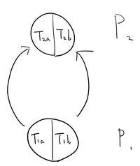

# 結び目グラフの同値判定
## 目次
1. 概要
2. 空頂点の削除
3. RI-
4. 頂点の結合
5. 再構築
6. 比較

## 1. 概要
2つの結び目グラフG1, G2(step>=1)は以下の手順で同値判定ができる。
+ 空頂点の削除
+ RI- 
+ 頂点の結合
+ 再構築
+ 比較

---

## 2. 空頂点の削除

空頂点nと任意の頂点a, bがあり、かつ辺(a, n, Ta, None)と(n, b, None, Tb)の2辺があるとき、この2辺と空頂点nを削除し辺(a, b, Ta, Tb)を追加できる。

---

## 3. RI-

Odd頂点Oと任意の頂点a, bがあり、かつ辺(O, O, A, B)または(O, O, B, A)があるとき、この辺とOdd頂点Oを削除し、この時
+ (a, O, Ta, B), (O, b, A, Tb)
+ (a, O, Ta, A), (O, b, B, Tb)
のどちらかのペアが存在しているためその2辺を削除し、(a, b, Ta, Tb)を追加する

---

## 4. 頂点の結合
### 前提
Odd頂点またはEven頂点である点P1, P2および、P1, P2と辺でつながっている頂点a, b, c, dがある。この時、a, b, c, dとつながっている辺はそれぞれ頂点のTa, Tb, Tc, Td側に繋がっているとする。

### typeの分類

+ (P1, P2, A, A), (P1, P2, B, B)
+ (P1, P2, A, B), (P1, P2, B, A)

のどちらかのペアが存在する場合type-A、

+ (P1, P2, A, A), (P2, P1, B, B)
+ (P1, P2, A, B), (P2, P1, A, B)
+ (P1, P2, B, A), (P2, P1, B, A)

のどれかのペアが存在する場合type-Bとして頂点の統合ができる。

この時、type-Aの2種とtype-Bの3種はそれぞれ頂点のABを入れ替えることで同じになるため、簡単のために以下のように表現する

#### type-A

(P1, P2, T1a, T2a), (P1, P2, T1b, T2b)

#### type-B

(P1, P2, T1a, T2a), (P2, P1, T2b, T1b)

### 偶奇の分類
P1, P2の偶奇の組み合わせによって以下の4種類に分かれる。
+ Odd-Odd
+ Even-Even
+ Odd-Even
+ Even-Odd

#### Odd-Odd
##### type-A

(a, P1, Ta, T1a), (P2, c, T2a, Tc), (b, P1, Tb, T1b), (P2, d, T2b, d)の4辺が存在する。

最初の2辺とこの4辺、およびP1, P2を削除し、

Even頂点Eと辺(a, E, Ta, T1a), (E, c, T1a, Tc), (b, E, Tb, T1b), (E, d, T1b, Td)を追加する。

##### type-B

(c, P2, Tc, T2a), (P1, a, T1a, Ta), (b, P1, Tb, T1b), (P2, d, T2b, Td)の4辺が存在する。

最初の二辺とこの4辺、およびP1, P2を削除し、

Even頂点Eと辺(c, E, Tc, T1a), (E, a, T1a, Ta), (b, E, Tb, T1b), (E, d, T1b, Td)を追加する。

#### Even-Even
##### type-A

Odd-Oddのtype-Aと同じ。

##### type-B

(a, P1, Ta, T1a), (P2, c, T2a, Tc), (d, P2, Td, T2b), (P1, b, T1b, Tb)の4辺が存在する。

最初の2辺とこの4辺、およびP1, P2を削除し、

Even頂点Eと辺(a, E, Ta, T1a), (E, c, T1a, Tc), (d, E, Td, T1b), (E, b, T1b, Tb)を追加する。

#### Odd-Even
##### type-A

(a, P1, Ta, T1a), (P2, d, T2b, d), (b, P1, Tb, T1b), (P2, c, T2a, Tc)の4辺が存在する。

最初の2辺とこの4辺、およびP1, P2を削除し、

Odd頂点Oと辺(a, O, Ta, T1a), (O, d, T1b, Td), (b, O, Tb, T1b), (O, c, T1a, Tc)を追加する。

##### type-B

(d, P2, Td, T2b), (P1, a, T1a, Ta), (b, P1, Tb, T1b), (P2, c, T2a, Tc)の辺が存在する。

最初の2辺とこの4辺、およびP1, P2を削除し、

Odd頂点Oと辺(d, O, Td, T1b), (O, a, T1a, Ta), (b, O, Tb, T1b), (O, c, T1a, Tc)を追加する。

#### Even-Odd
##### type-A

Odd-Evenのtype-Aと同じ。
##### type-B

(a, P1, Ta, T1a), (P2, d, T2b, Td), (c, P2, Tc, T2a), (P1, b, T1b, Tb)の4辺が存在する。

最初の2辺とこの4辺、およびP1, P2を削除し、

Odd頂点Oと辺(a, O, Ta, T1a), (O, d, T1b, Td), (c, O, Tc, T1a), (O, b, T1b, Tb)を追加する。

---

## 5. 再構築
グラフに対し2~4までの操作を可能な限り行うことで、頂点と辺の数がこれ以上減らない状態まで到達する。S+を除けば頂点数が増える処理は「空頂点の追加」「RI+」「頂点の分割」だけであり、2~4がそれぞれの逆操作になっているためである。

G1とG2が同値の場合、2つのグラフの頂点の数と辺の数が等しく、頂点の番号やABだけでずれている状態になっている。これを愚直に比較しようとすると、頂点数をnとしてn!*2^n通りを列挙することになり、現実的でない。

ここでグラフGに対して、以下のような処理を考える。
1. 空のグラフオブジェクトXを用意する
2. 元のグラフGの適当な辺をひとつ選ぶ。その辺の始点を頂点番号0としてXに追加する(頂点の偶奇はそのまま写す)
3. 2.で選んだ辺からGのオイラー閉路を辿る。
4. 途中で新しい頂点(Xに追加されていない頂点)を通ったら連番で番号をつける。この時、先に入ったA(またはB)をAとする。この時、最初の辺は頂点0のBから出ているとする。
5. 4.のルールを守りながら通った辺をXに辺を追加していく

### 実装

---

## 6. 比較
5.のアルゴリズムによって生成されたグラフXは、Gをある命名規則に則って再構築したものといえる。Gが辺をn本持つ場合、最初の辺の選び方によってn通りのXが存在する。

G1を再構築したX1とG2を再構築したX2がn通りずつあるとき、X1i=X2jとなる(i, j)が存在すれば、G1とG2は同一であると言える。

### 実装
### 計算量