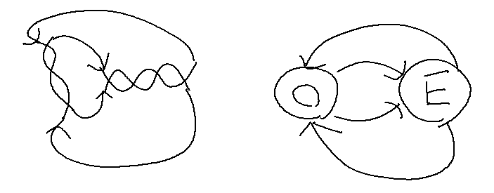

### step1

(i, O), (O, j), (j, O), (O, i)

### step2-1

(i, O1), (O1, O2), (O2, j), (j, O2), (O2, O1), (O1, i)

#### step1to2-1
step1のOをO1とおく。辺は

(i, O1), (O1, j), (j, O1), (O1, i)になる。

iを始点とした経路[(i, O1), (O1, j), (j, O1), (O1, i)]を考え、(O1, j)と(j, O1)に対してS+(Odd)を行う。

(O1, j)と(j, O1)が消え、(O1, O2), (j, O2), (O2, j), (O2, O1)が追加される。辺を比較するとstep2-1と一致している。

---

### step2-2

(O, E), (E, O), (O, E), (E, O)

#### step1to2-2
step1において、Oを始点とした経路[(O, i), (i, O)]と[(O, j), (j, O)]を考える。この時(O, i)と(j, O)に対してS+(Even)を適用。(O, i)と(j, O)が消え、(O, E), (E, i), (j, E), (E, O)が追加される。

よって辺全体は

(i, O), (O, j), (O, E), (E, i), (j, E), (E, O)になる。空頂点の定義より、[(E, i), (i, O)]と[(O, j), (j, E)]がそれぞれ(E, O)と(O, E)にまとめられる。よって全体は(O, E), (E, O), (E, O), (O, E)になる。これはstep2-2と一致している。

---

### step2-3

(O1, O2), (O2, E), (E, O2), (O2, O1), (O1, E), (E, O1)

#### step1to2-3
step1のOをO1とおく。辺は

(i, O1), (O1, j), (j, O1), (O1, i)になる。

O1のタイプを判別する。O1が始点の二経路は[(O1, j), (j, O1)]と[(O1, i), (i, O1)]である。それぞれが異なるため、O1はtypeAである。O1を分割する。(O1, j), (O1, i)を削除し、(O1, E), (E, j)と(O1, E), (E, i)を追加する。全体としての辺は

(i, O1), (j, O1), (O1, E), (E, j), (O1, E), (E, i)になり、空頂点を消すと(O1, E), (E, O1), (O1, E), (E, O1)になる。O1を始点とした経路[(O1, E), (E, O1)]に対してS+(Odd)を適用する。(O1, E), (E, O1)が削除され、(O1, O2), (E, O2)と(O2, E), (O2, O1)が追加される。

全体としての辺は(O1, E), (E, O1), (O1, O2), (E, O2), (O2, E), (O2, O1)になり、これはstep2-3と一致する。