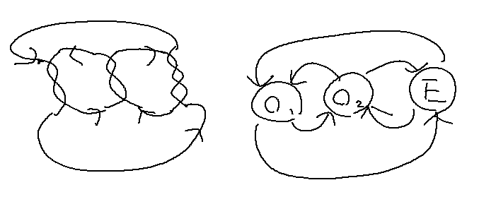
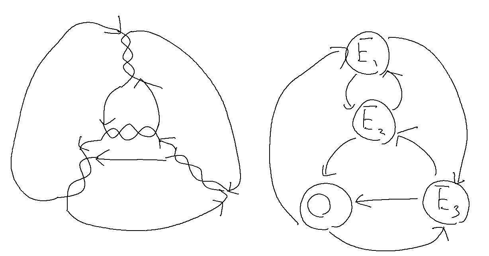
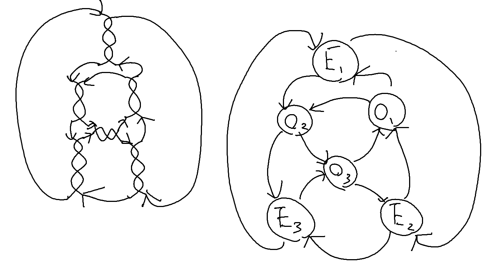
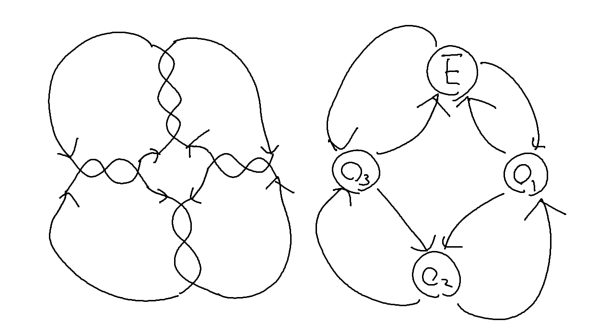
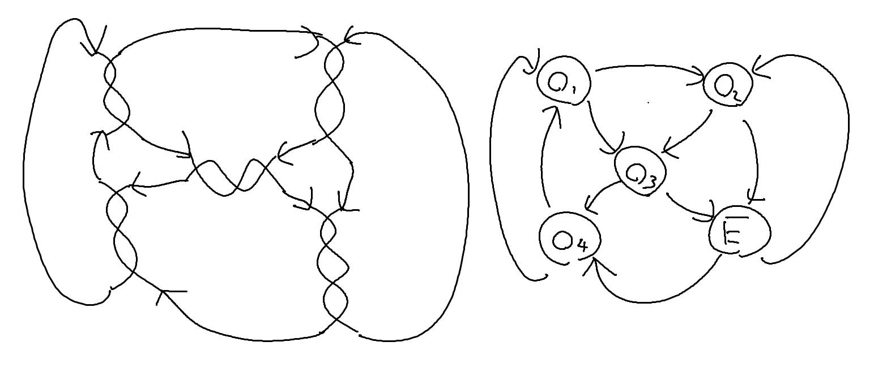
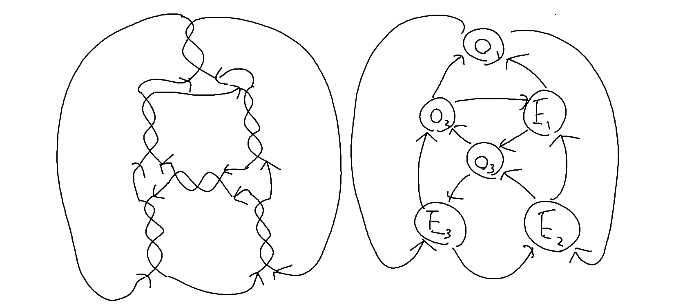
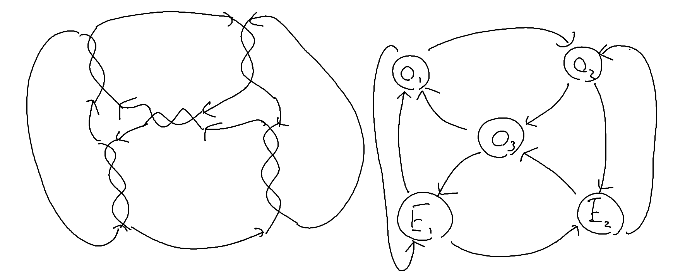
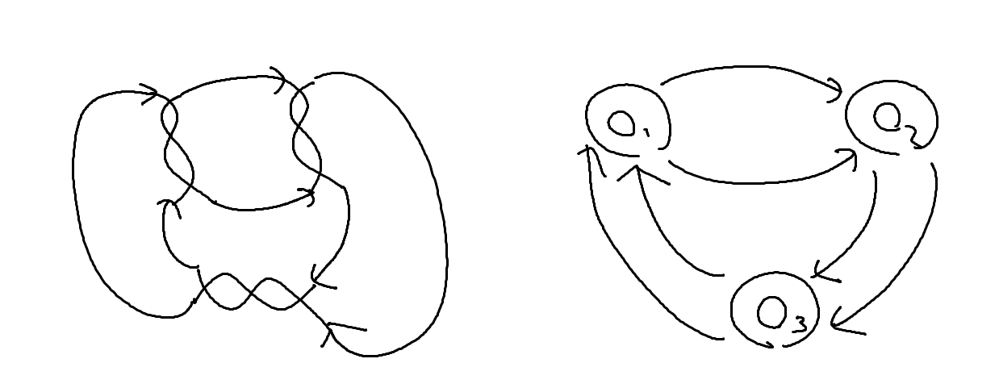
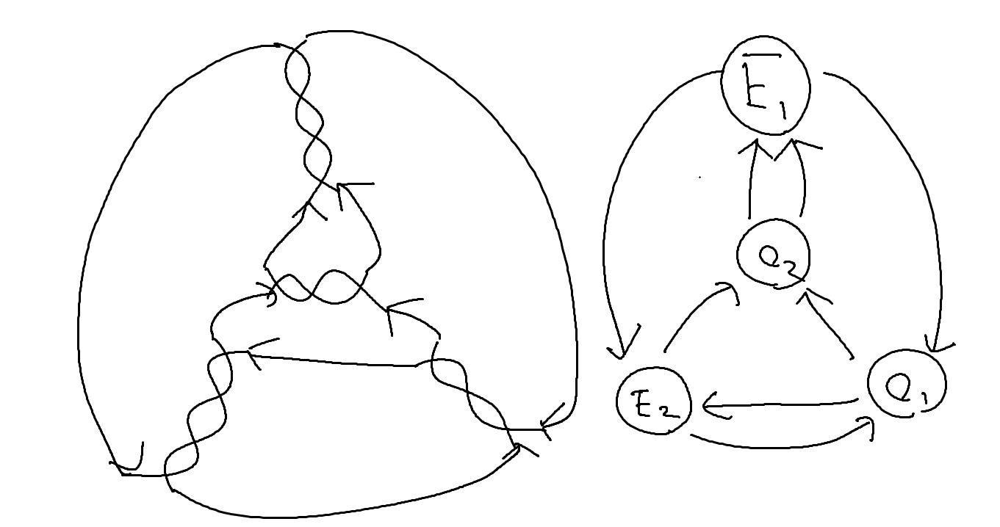

### step2-1

(i, O1), (O1, O2), (O2, j), (j, O2), (O2, O1), (O1, i)

### step2-2

(O, E), (E, O), (O, E), (E, O)

### step2-3

(O1, O2), (O2, E), (E, O2), (O2, O1), (O1, E), (E, O1)

---

### step3-1(P1-1ab)

(O, E1), (E1, O), (O, E2), (E2, E1), (E1, E2), (E2, O)

#### 2-2 to 3-1
EをE1とする。辺は(O, E1), (E1, O), (O, E1), (E1, O)になる。
Oを始点とした経路A: [(O, E1), (E1, O)]とB: [(O, E1), (E1, O)]がある。Aの(O, E1)とBの(E1, O)に対してS+(Even)を適用する。(O, E1), (E1, O)を削除し、(O, E2), (E2, E1), (E1, E2), (E2, O)を追加する。全体としての辺は(E1, O), (O, E1), (O, E2), (E2, E1), (E1, E2), (E2, O)になり、これはstep3-1と一致する。

---

### step3-2(P1-1ac)

(E1, E3), (E3, E2), (E2, O), (O, E3), (E3, O), (O, E1), (E1, E2), (E2, E1)

#### 2-2 to 3-2
EをE1とする。辺は(O, E1), (E1, O), (O, E1), (E1, O)になる。
Oのタイプを判別する。O始点の経路が二つとも[(O, E1), (E1, O)]のため、typeBである。片方の[(O, E1), (E1, O)]に対し、分割を適用する。(O, E1), (E1, O)を削除し(O, E2), (E2, E1), (E1, E2), (E2, O)を追加する。全体の辺は(O, E1), (E1, O), (O, E2), (E2, E1), (E1, E2), (E2, O)になる。ここでOを始点とした経路[(O, E2), (E2, E1), (E1, E2), (E2, O)]と[(O, E1), (E1, O)]の(O, E2)と(E1, O)に対してS+(Even)を適用する。

(O, E2), (E1, O)を削除し(O, E3), (E3, E2), (E1, E3), (E3, O)を追加する。全体としての辺は

(O, E1), (E2, E1), (E1, E2), (E2, O), (O, E3), (E3, E2), (E1, E3), (E3, O)

になり、これはstep3-2と一致する。

---

### step3-3(P1-2ab)

(E, O1), (O1, O2), (O2, E), (E, O2), (O2, O1), (O1, E)

#### 2-2 to 3-3
OをO1とおく。(O1, E), (E, O1), (O1, E), (E, O1)になる。O1を始点とした経路[(O1, E), (E, O1)]の(O1, E), (E, O1)についてS+(Odd)を適用する。(O1, E), (E, O1)は削除され、(O1, O2), (E, O2), (O2, E), (O2, O1)が追加される。全体としての辺は(O1, E), (E, O1), (O1, O2), (E, O2), (O2, E), (O2, O1)になる。これはstep3-3と一致する。

---

### step3-4(P1-2ac)

(E1, O1), (O1, E2), (E2, E1), (E1, O1), (O1, O2), (O2, E2), (E2, O2), (O2, E1)

#### 2-2 to 3-4
EをE1, OをO1とおく。(O1, E1), (E1, O1), (O1, E1), (E1, O1)になる。次にO1を分割するため、タイプを判別する。O1を始点とした2経路A: [(O1, E1), (E1, O1)], B: [(O1, E1), (E1, O1)]がある、A=Bのため、typeBである。A: [(O1, E1), (E1, O1)]について分割する。(O1, E1), (E1, O1)を削除し、(O1, E2), (E2, E1), (E1, E2), (E2, O1)を追加する。全体としての辺は

(O1, E1), (E1, O1), (O1, E2), (E2, E1), (E1, E2), (E2, O1)になる。O1を始点とした経路[(O1, E2), (E2, E1), (E1, O1)]を考え、(O1, E2), (E2, E1)に対してS+(Odd)を適用する。
(O1, E2), (E2, E1)を削除し、(O1, O2), (E2, O2), (O2, E2), (O2, E1)を追加する。全体としての辺は

(O1, E1), (E1, O1), (E1, E2), (E2, O1), (O1, O2), (E2, O2), (O2, E2), (O2, E1)になる。これはstep3-4と一致する。

---

### step3-5(P2-1ab)

(E, O1), (O1, O2), (O2, E), (E, O3), (O3, O1), (O1, O2), (O2, O3), (O3, E)

#### 2-2 to 3-5
OをO1とおく。(O1, E), (E, O1), (O1, E), (E, O1)。Eを分割する。[(E, O1), (O1, E)]が二つあることから、typeAである。(O1, E), (E, O1), (O1, E), (E, O1)を削除し、(O1, O2), (O1, O2), (O2, O3), (O2, O3), (O3, O1), (O3, O1)を追加する。全体としての辺は

(O1, O2), (O1, O2), (O2, O3), (O2, O3), (O3, O1), (O3, O1)

O3を始点とした経路[(O3, O1), (O1, O2), (O2, O3)]が二つある。(O3, O1)と(O2, O3)についてS+(Even)を適用する。(O3, O1)と(O2, O3)を削除し、(O3, E), (E, O1), (O2, E), (E, O3), を追加する。全体としての辺は

(O1, O2), (O1, O2), (O2, O3), (O3, O1), (O3, E), (E, O1), (O2, E), (E, O3)

となり、これはstep3-5と一致する。

#### 2-3 to 3-5
新定義のS+(Odd)を用いて後述

---

### step3-6(P2-2ab)

(E1, E2), (E2, O1), (O1, O2), (O2, E3), (E3, E1), (E1, O2), (O2, O3), (O3, E2), (E2, E3), (E3, O3), (O3, O1), (O1, E1)

#### 2-3 to 3-6
EをE1とする。(O1, O2), (O2, E1), (E1, O2), (O2, O1), (O1, E1), (E1, O1)。2-3のO!, O2はtypeAである。O1とO2を分割する。

##### O1の分割
(O2, O1), (E1, O1)を削除し、(O2, E2), (E1, E2), (E2, O1), (E2, O1)を追加する。全体としての辺は

(O1, O2), (O2, E1), (E1, O2), (O1, E1), (O2, E2), (E1, E2), (E2, O1), (E2, O1)

##### O2の分割
(O2, E1), (O2, E2)を削除し、(O2, E3), (O2, E3), (E3, E1), (E3, E2)を追加する。全体としての辺は

(O1, O2), (E1, O2), (O1, E1), (E1, E2), (E2, O1), (E2, O1), (O2, E3), (O2, E3), (E3, E1), (E3, E2)になる。

O2を始点とした経路[(O2, E3), (E3, E2), (E2, O1), (O1, O2)]の(O2, E3), (E2, O1)に対してS+(Odd)を適用する。(O2, E3), (E3, E2), (E2, O1)を削除し、(O2, O3), (E3, O3), (E2, E3), (O3, E2), (O3, O1)を追加する。全体としての辺は

(O1, O2), (E1, O2), (O1, E1), (E1, E2), (E2, O1), (O2, E3), (E3, E1), (O2, O3), (E3, O3), (E2, E3), (O3, E2), (O3, O1)

になり、step3-6と一致する。

---

### step3-7(P2-2cd)

---

### step3-8(P2-3ab)

---

### step3-9(P2-3bd)

---

### step3-10(P3ab)

---

### step3-11(P3cd)

---

### step3-12(P5ab/P5cd)
